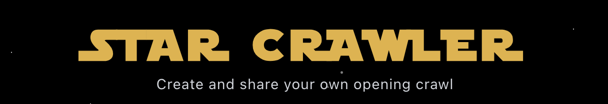
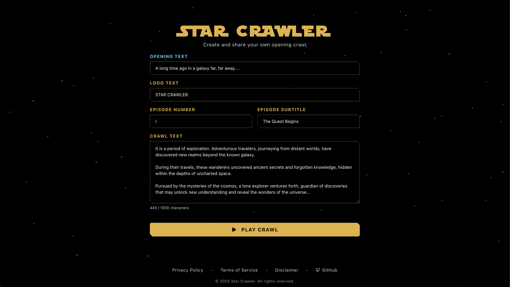
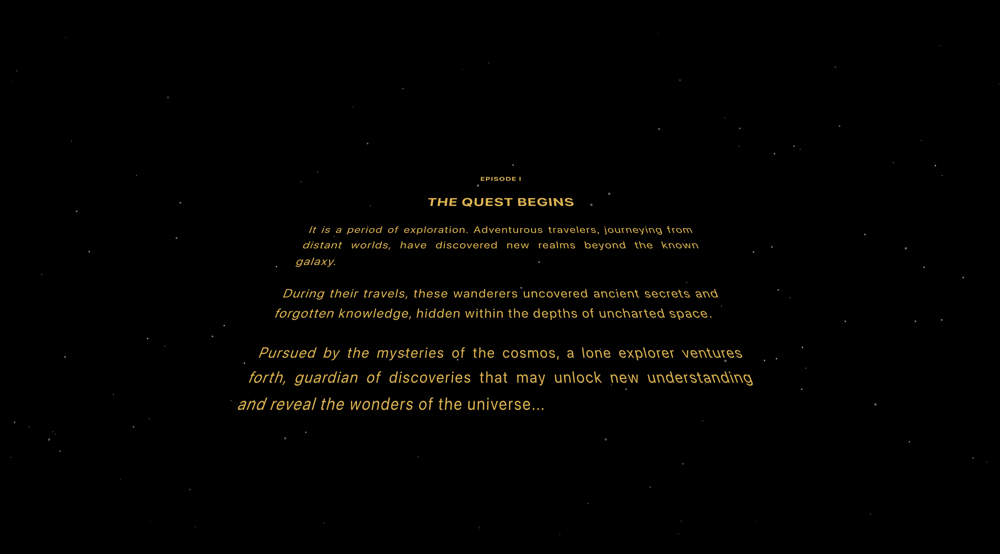

<div align="center">



**Create and share cinematic opening crawl animations**

[](https://opensource.org/licenses/MIT)
[](https://nextjs.org/)
[](https://www.typescriptlang.org/)
[](https://react.dev/)

[Visit App](https://starcrawler.vercel.app) • [Report Bug](https://github.com/mochixlb/starcrawler/issues) • [Request Feature](https://github.com/mochixlb/starcrawler/issues)

</div>

---

## Screenshots





---

## Features

### Core Functionality

- **Three-Phase Animation** - Opening text → logo → scrolling crawl with animated starfield background
- **Custom Fonts** - Star Jedi font (regular for titles, hollow for logo)
- **Playback Controls** - Play/pause, seek slider, and fullscreen mode
- **Keyboard Shortcuts** - Space (pause/resume), Arrow keys (seek ±5s), F (fullscreen), Escape (stop)

### User Experience

- **URL-Based Sharing** - Shareable links with encoded crawl data (no database required)
- **Accessibility** - Respects `prefers-reduced-motion` preferences
- **Responsive Design** - Optimized for desktop and mobile
- **Privacy-Focused** - All data stored in URL, no server-side storage

---

## Quick Start

### Prerequisites

- Node.js 18+ and npm (or yarn/pnpm)

### Installation

```bash
# Clone the repository
git clone https://github.com/mochixlb/starcrawler.git

# Navigate to the project directory
cd starcrawler

# Install dependencies
npm install

# Start the development server
npm run dev
```

Open [http://localhost:3000](http://localhost:3000) in your browser to see the application.

---

## Tech Stack

### Core Framework

- **[Next.js 16](https://nextjs.org/)** - React framework with App Router
- **[React 19](https://react.dev/)** - UI library
- **[TypeScript](https://www.typescriptlang.org/)** - Type safety

### Styling & UI

- **[Tailwind CSS 4](https://tailwindcss.com/)** - Utility-first CSS framework
- **[Framer Motion](https://www.framer.com/motion/)** - Animation library
- **[Lucide React](https://lucide.dev/)** - Icon library

### Key Libraries

- **[Zod](https://zod.dev/)** - Schema validation
- **[@hexagon/base64](https://github.com/LinusU/base64-arraybuffer)** - Base64 encoding for URL data
- **[react-error-boundary](https://github.com/bvaughn/react-error-boundary)** - Error boundary component

---

## Building for Production

### Environment Variables

For production deployment, set the following environment variable:

```bash
NEXT_PUBLIC_SITE_URL=https://your-domain.com
```

**Important:** The URL must be a valid HTTPS URL without a trailing slash.

### Build Commands

```bash
# Create production build
npm run build

# Start production server
npm start
```

---

## Testing

```bash
# Run tests
npm test

# Run tests with UI
npm run test:ui

# Run tests once
npm run test:run

# Run tests with coverage
npm run test:coverage
```

The project includes a comprehensive test suite with 112 tests covering validation logic, utility functions, and UI components.

---

## Usage

1. Enter opening text, logo, episode number, subtitle, and crawl text
2. Click "Play Crawl" to start the animation
3. Use controls to pause, seek, or toggle fullscreen
4. Click "Share" to copy the URL to your clipboard

Animation timing, colors, and fonts are centralized in `lib/constants.ts` and `app/globals.css` for easy customization.

---

## Project Structure

```
starcrawler/
├── app/
│   ├── page.tsx
│   ├── layout.tsx
│   └── ...
├── components/
│   ├── crawl/
│   └── ui/
├── lib/
│   ├── constants.ts
│   ├── types.ts
│   ├── utils.ts
│   └── validation.ts
└── public/
    └── fonts/
```

---

## Contributing

Contributions are welcome! Please feel free to submit a Pull Request.

1. Fork the repository
2. Create your feature branch (`git checkout -b feature/AmazingFeature`)
3. Commit your changes (`git commit -m 'Add some AmazingFeature'`)
4. Push to the branch (`git push origin feature/AmazingFeature`)
5. Open a Pull Request

---

## License

This project is licensed under the MIT License - see the [LICENSE](LICENSE) file for details.

---

## Acknowledgments

- Built with [Next.js](https://nextjs.org/) and [React](https://react.dev/)
- Star Jedi fonts used for authentic crawl appearance
